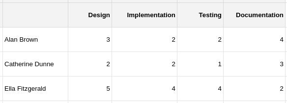

# Introduction

Welcome to the CA2 Rubric handbook. This handbook will walk you through the Rubric project , the features it contains and how to run it.

 A Rubric is made up of multiple Criteria (up to a maximum of 10). When a student is graded they are awarded a score for each Criterion in the Rubric, which is an integer value between 1 and 5. This project works simlarly. Users can create a new Rubric, add a Criterion to a Rubric, get a list of all Rubrics, get a specific Rubric by name.

