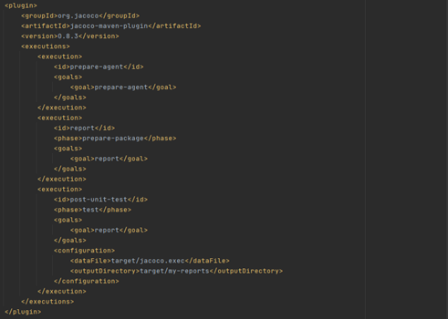
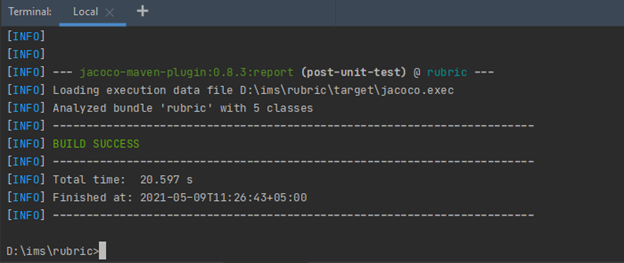
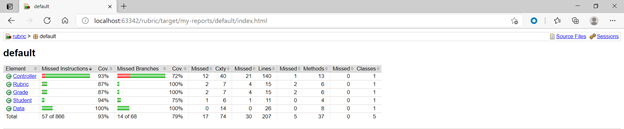
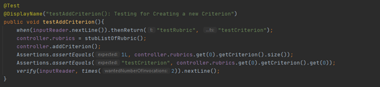
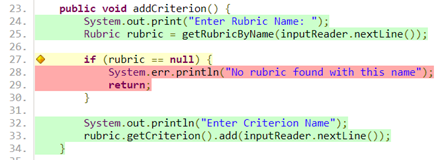
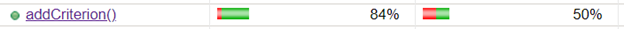
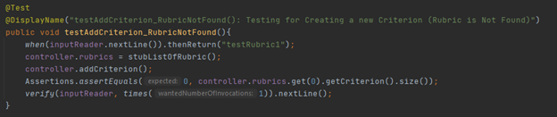
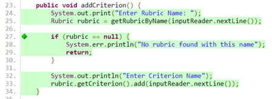

# Introduction

 A Rubric is made up of multiple Criteria (up to a maximum of 10). When a student is graded they are awarded a score for each Criterion in the Rubric, which is an integer value between 1 and 5. This project works simlarly. Users can create a new Rubric, add a Criterion to a Rubric, get a list of all Rubrics, get a specific Rubric by name.This handbook will walk you through the Rubric project , the features it contains and how to run it.

## Scrum sprint backlog and task estimation

**Total Estimated Hrs: 70**

**Estimate of days needed: 8.75**

- Backlog is the order of the tasks by priority.
- SP Accumulated allows you to see how much user stories the team can take in the first sprint summing up their SP
- Estimated Hrs shows the time needed to complete the PBI.

How the estimates were chosen?

Fibonacci was used to set the numeric values for the estimations, following the approach that something that is 2 SP will be twice harder than something that is 1 SP. Each Fibanacci value has a number of Hours associated to denote how much time the team will have to complete a PBI. PBI #1 and #5 have 5 SP because they are about creating and inserting new records into the data which is usually harder than just simply quoting the data.

**Comparing the difficulty of 2 tasks with different estimates**

PBI #9 and PBI #4 they both have 2 SP(story points) and 5 SP respectively because calculating the standard deviation in a programming language is easier than creating a quote to get a specific record from a database (whatever the database is). In my case, Java is easier to use because of the  pre-defined function to calculate Standard Deviation.However, getting an specific record is more difficult because the user needs to write the query and make it efficient so it doesn't take that much time when retrieving the data.

**How the velocity metric is calculated at the end of each sprint? and How it feeds into planning for the next Sprint?**

The velocity is the amount of work the team gets through in a Sprint. It is calculated by checking all User Stories to make sure its completed and  complies with the Definition of Done set at the beginning of the project. You need to sum all the story points from the completed user stories and  that'd be your Velocity for Sprint 1.
For the next Sprint the team need to take into consideration the Velocity of the previous sprint and take the remaining User Stories from the previous Sprint (user stories that were not completed). They also need to sum up the Story points  and check that the total is not greater than the Velocity of the previous sprint.  

The Scrum master needs to have in mind the sum of the SP for all user stories selected for next sprint plus the SP of all unfinished user stories that's  not greater than the Velocity of the previous sprint. After 3 sprints, the Scrum master can calculate the average velocity and the team can work with that number whenever they are planning new sprints and selecting user stories to work on.

## Unit testing and Test-Driven development

Test driven development is a software development approach where tests are being written, before writing the bare minimum of code required for the test to be fulfilled. The code will then be refactored, as often as necessary, in order to pass the test, with the process being repeated for each piece of functionality.

I followed a sequence of steps for my TDD as below:

1. Write Test.
2. Run Test.
3. Check for failed tests.
4. Make changes to the code.
5. Repeat from step 2.

An example of this was when I was testing my Data.java class which will contain code that provides summary calculations across all graded students. These calculations include getting the average, standard deviation, minimum and maximum score for a Rubric and specific criterion of a Rubric.

Sample data used for DataTest:
**10, 25, 15, 30, 65**

## Test coverage metric

**Coverage Tool**

For this Project, the Code Coverage Tool being used is JaCoCo. JaCoCo is an Open-Source code coverage tool for Java Applications that identifies and shows which lines of code have been covered by the Unit Tests  written.

**Setting Up the JaCoCo**

For setting up the JaCoCo, you just need to add the JaCoCo and Maven Surefire Plugin in the pom.xml file.

- The JaCoCo Plugin is used to generate the Code Coverage Report.
- The Maven Surefire Plugin is used to execute all the unit test cases when the Maven test lifecycle command is executed.

The < outputDirectory > tag would contain the file path where the Coverage Report would be generated. In this project we have added the file path as target/my-reports where the Coverage report would be generated in this project.

Note: Surefire Plugin will only pick all the classes that are placed in the directory src/test/java and the class name should also contain the Test keyword in name just like DataTest and ControllerTest classes in this project.

**Running the JaCoCo**

For creating the Code Coverage Report,  you just need to run the Maven Test Command which will first execute all the Unit Tests and then generate the report in the file path specified in the < outputDirectory> tag specified in the pom.xml under the JaCoCo Plugin Configuration (which in case of this project is target/my-reports)

**Note:** We have added the test as a phase in the < phase> tag specified in the pom.xml under the JaCoCo Plugin Execution which means that the reports would be generated when the test phase is executed.

For Running the Maven Test Lifecycle command:

- Go to Maven Tab -> Click Lifecycle -> Double Click test
- Or simply run the command mvn test in the terminal

After running the maven test life cycle command and the build is successful then you can view the report by opening the index.html file in any browser placed in the file path target/my-reports.

**Identifying Gaps in Test Coverage**

The JaCoCo report identifies each line of the code with one of the following three status:

1. No coverage (red background) Not a single instruction in the line has been executed.
2. Partial coverage (yellow background) Only a part of the instruction in the line have been executed.
3. Full coverage (green background) All instructions in the line have been executed.

**Find out more at:** <https://www.eclemma.org/jacoco/trunk/doc/counters.html>

The report can help us identify which lines of code have not been covered in the unit tests and write test cases for them too. This would also improve the Code Coverage Percentage.

Example: testAddCriterion() - Testing the Creation of a new Criterion

This test case would test the creation of a new Criterion by mocking the two inputs taken from the user that are the Rubric Name and Criterion Name.

The result of the report for this method identified that the line number 27 is Partially Covered and the line number 28 and 29 are Not Covered at all in the addCriterion() method.

And the code coverage for this method is currently 84%.

This helped us to know that a separate test case testAddCriterion_RubricNotFound() should be written if the Rubric Name provided by the user does not exist in the system.

The result of the report after writing the test case testAddCriterion_RubricNotFound() which would cover the case if the Rubric is Not Found. And now all the lines in the method are Fully Covered.

And by this the code coverage for this method went from 84% to 100%

## Team version-control

Gitflow is a branching model for Git. It is a set of guidelines that developers can follow when using version control. GitFlow is not hard core rules but guidelines which are not set in stone.

### Benefit of GitFlow

1. The simplicity of the basic model makes git-flow easy to understand, thus ensuring the highest productivity in a short period of time.
I created three branches excluding the main branch. Develop, Student and Data:

 Develop

- served as a final integration branch for all features.
- Implemented Controller and Rubric with its Criterion Classes.

    Student
- Served as an integration branch for creating Student and their grades and adding it to rubric.

    Data
- Served as an integration branch for getting the statistics and relevant scores of Rubrics and its criterions.

2. Git-flow makes it easy to adapt itself to any stage of the project development life cycle, because it does not have any prerequisites. It does not matter how far or how far you go in the development lifecycle; git-flow can be included and adjusted almost immediately.

For example, When I was testing how to calculate the rubric statistics in the Data branch, I implemented changes to the Controller class, but the changes failed, and I needed the old code back. I was able to get the old code from previous commits in the develop branch thanks to my commitment to the git-flow process.

3. Git-flow ensures that at any specific moment in the project life cycle, the status of the branch is clearly identifiable.

## Code-review checklist

Code review is a phase in the software development process in which SQA testers review code. Code review checklists can make code review practice much more beneficial to the team and project and significantly speed up code reviews. Below is the checklist that I tried to implement in my review of my code.

Code Review Checklist:

**Implementation**

- Did this code change perform as expected?
- Does a similar function already exist in the code base? If so, why not reuse this feature?

Logic Errors and Bugs

- Can you think of any use case in which the code does not behave as intended?

**Testing**

- Is the code testable?
- Does it have enough automated tests (unit tests)?
- Do the existing tests reasonably cover the code change?

**Dependencies**

- If this change requires an update outside the code, such as an updated documentation/readme file, has it been completed?

**Readability**

- Is the code easy to understand?
- Can the readability of the code be improved by smaller methods?
- Is it possible to improve the readability of the code through different function/method or variable names?
- Will more comments make the code easier to understand?
